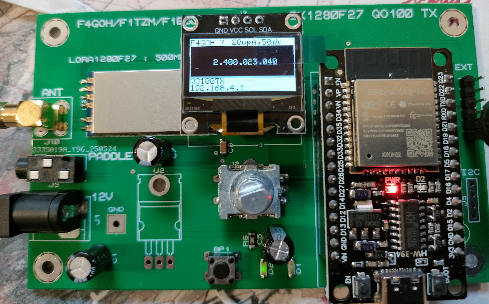
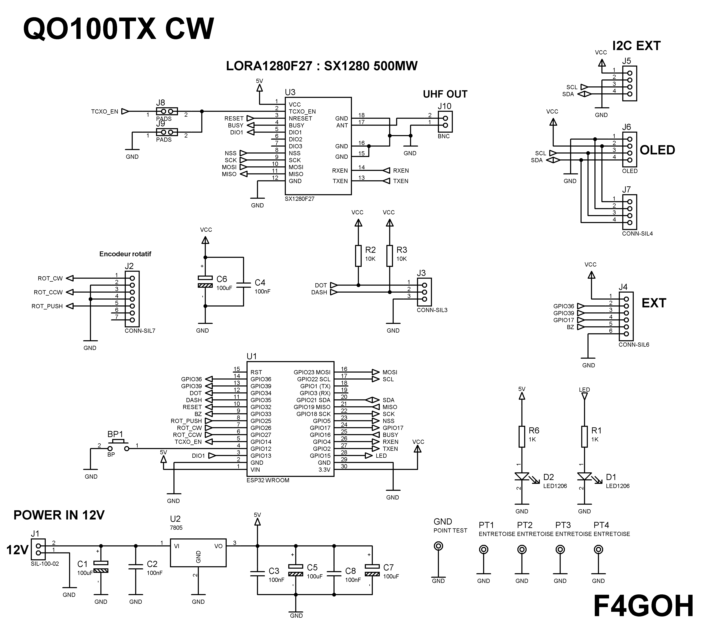
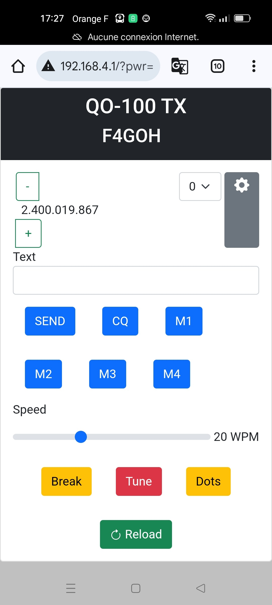
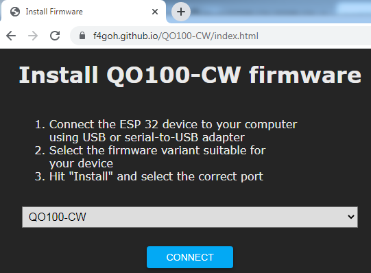

# QO100-CW

Ondrej [OK1CDJ](https://github.com/ok1cdj/SX1281_QO100_TX) has used the SX1281 module (LoRa 2.4 GHz chipset) to transmit telegraphy (CW) via QO-100. 
His QO-100 TX project stands out for itssimplicity, with an Arduino-compatible interface,an integrated OLED screen and open-source firmware.
It offers high efficiency, with just 450 mW of power.

I have redesigned the PCB because it was not available.

## Schématics

## PCB

## Web Control

## Automatic [firmwares](https://f4goh.github.io/QO100-CW/index.html) installation in esp32 (no compilation)

